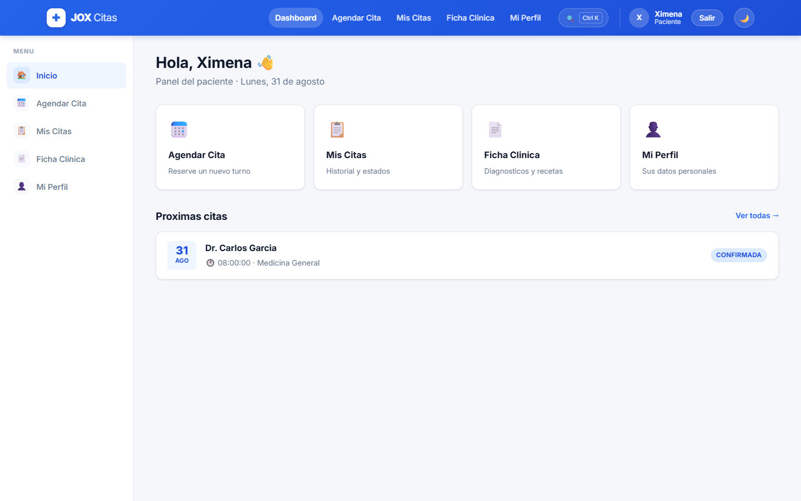
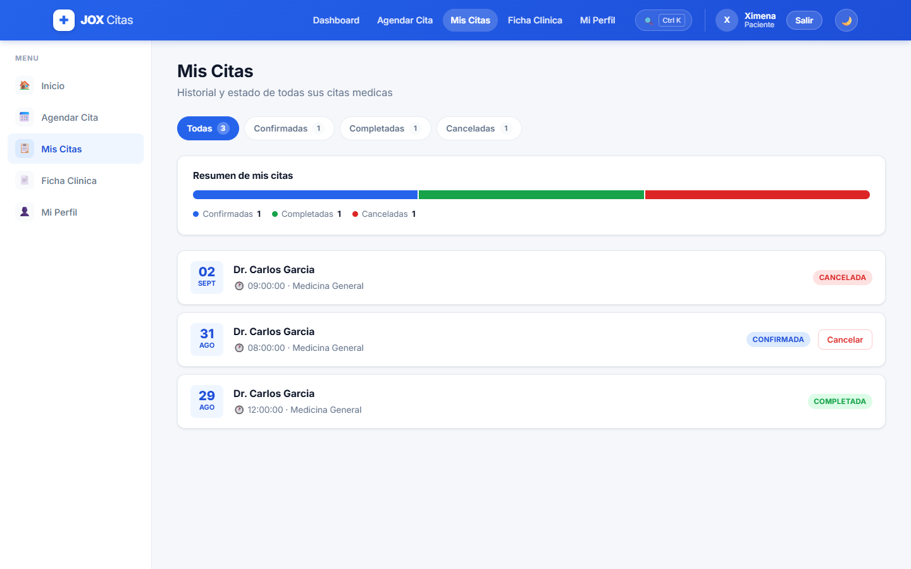
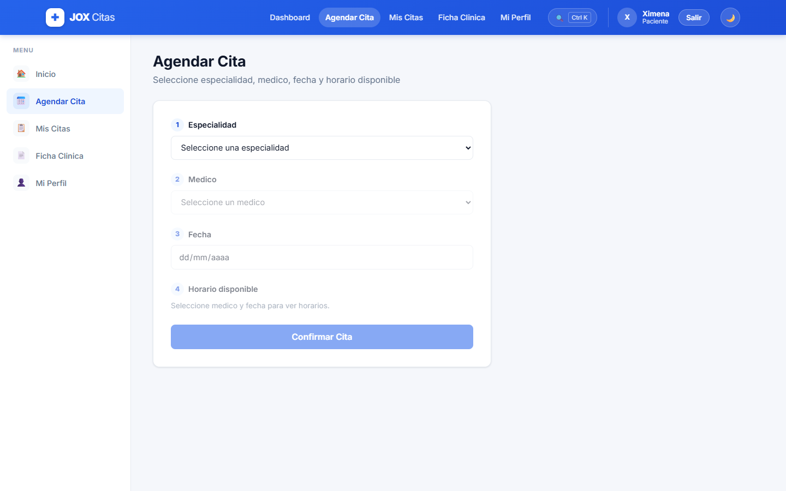
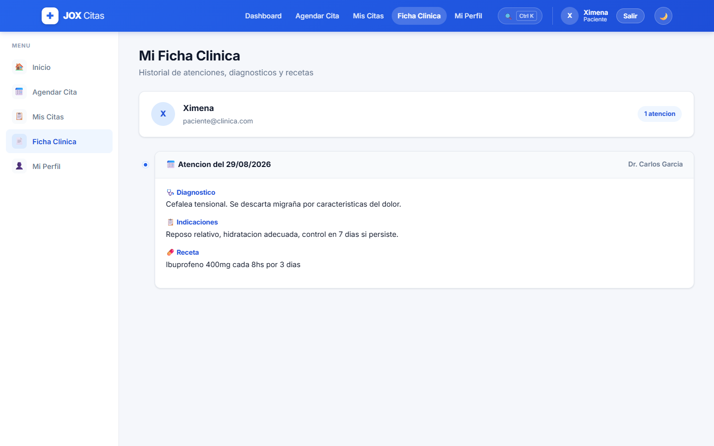
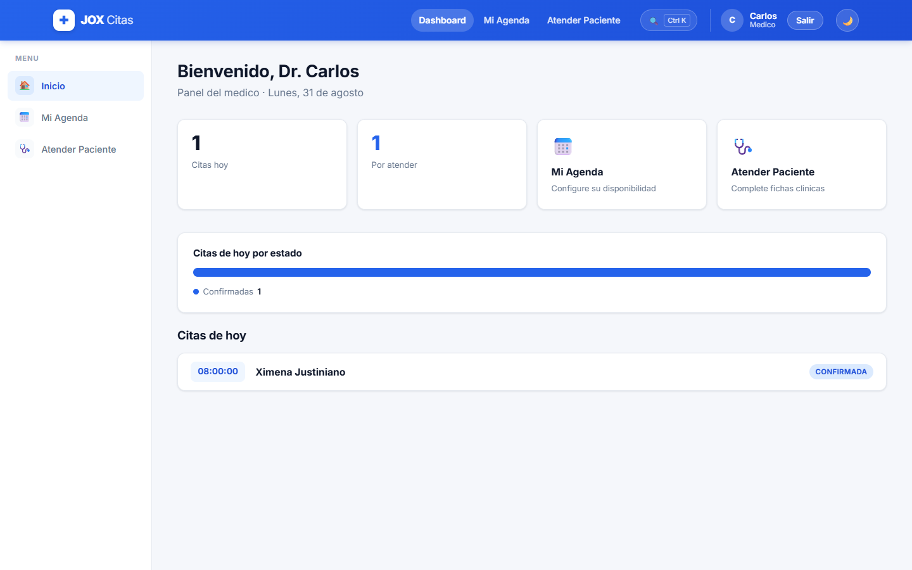
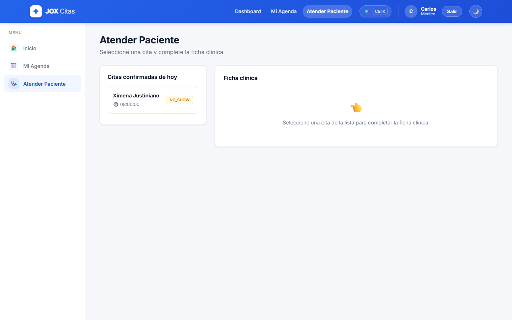
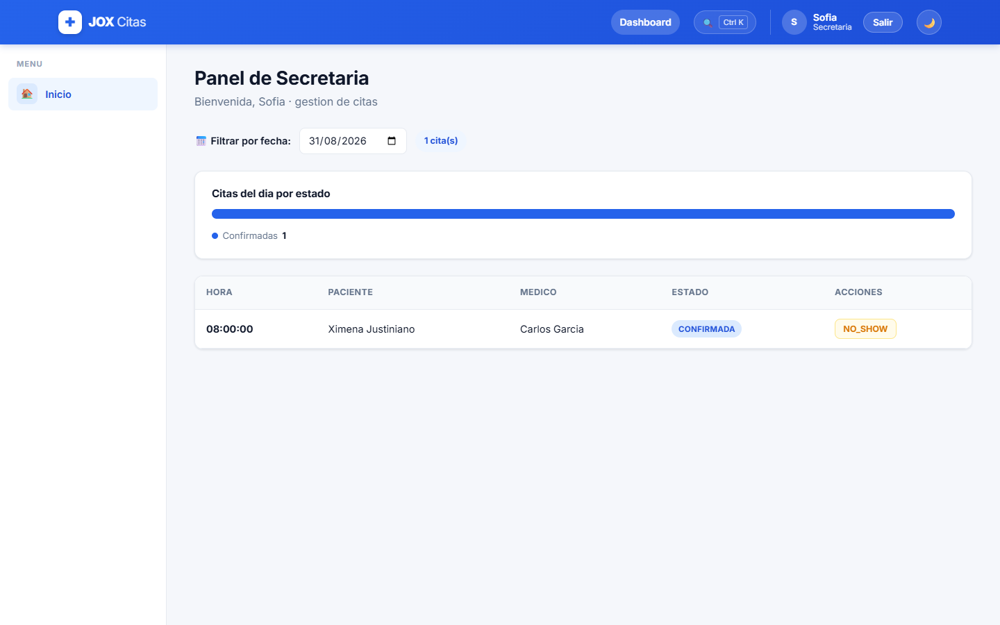
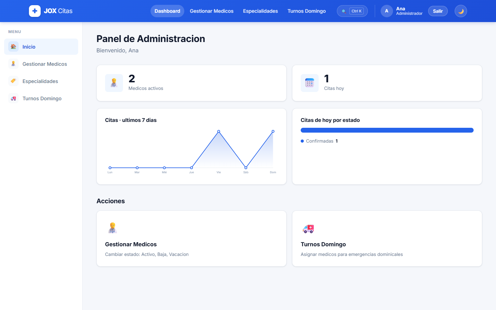
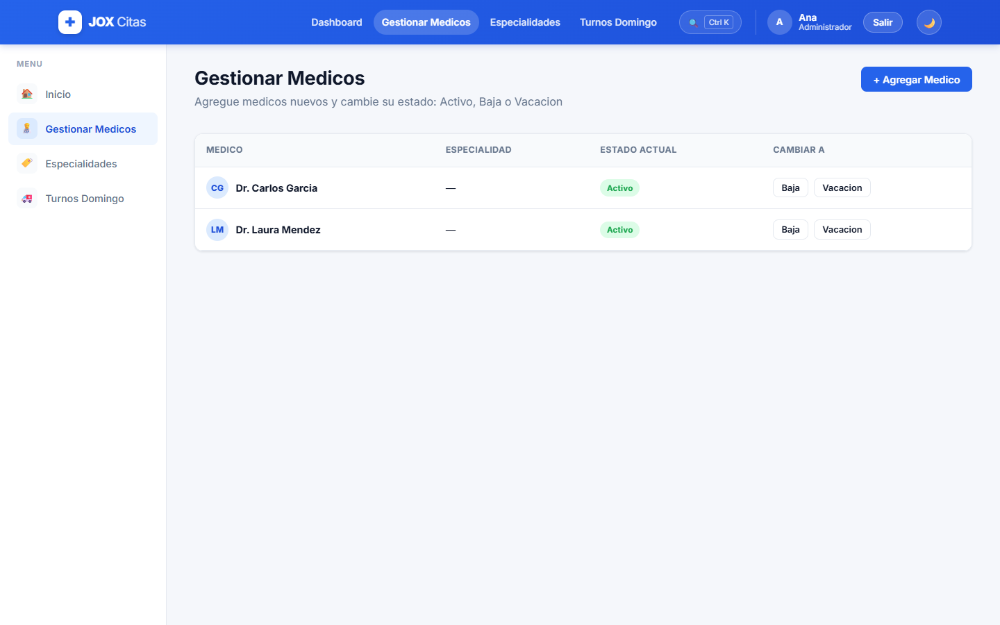
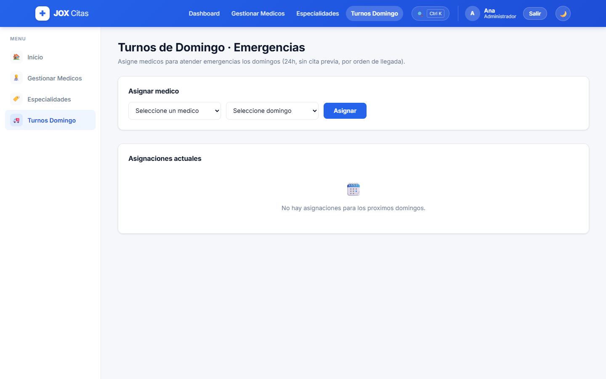

# Manual Tecnico — Plataforma de Citas Medicas (JOX Citas)

**Version:** 1.0
**Fecha:** 31 de agosto de 2026
**Proyecto:** Capstone — Diplomado Programacion Asistida con IA
**Autora:** Ximena Justiniano Lujan

Este manual describe la arquitectura, las tecnologias, el modelo de despliegue y el
funcionamiento del sistema ya en produccion, con capturas reales de cada rol. Es el
documento de referencia tecnica que acompana al [SDD-v3.md](SDD-v3.md) (diseno del
sistema) y al [BDD-v2.md](BDD-v2.md) (comportamiento esperado).

## Indice

1. [Proposito del sistema](#1-proposito-del-sistema)
2. [Arquitectura general](#2-arquitectura-general)
3. [Tecnologias utilizadas](#3-tecnologias-utilizadas)
4. [Estructura del proyecto](#4-estructura-del-proyecto)
5. [Modelo de datos (resumen)](#5-modelo-de-datos-resumen)
6. [Seguridad y control de acceso](#6-seguridad-y-control-de-acceso)
7. [API — endpoints principales](#7-api--endpoints-principales)
8. [Despliegue en produccion](#8-despliegue-en-produccion)
9. [Calidad: pruebas automatizadas y CI](#9-calidad-pruebas-automatizadas-y-ci)
10. [Capturas del sistema por rol](#10-capturas-del-sistema-por-rol)
11. [Limitaciones conocidas y trabajo futuro](#11-limitaciones-conocidas-y-trabajo-futuro)

---

## 1. Proposito del sistema

Plataforma web para gestionar citas medicas en una clinica, con cuatro roles
diferenciados: **paciente**, **medico**, **secretaria** y **administrador**. Permite
agendar y cancelar citas, llevar la ficha clinica de cada atencion (diagnostico,
indicaciones, receta y documentos adjuntos), gestionar la agenda de los medicos,
controlar inasistencias (NO_SHOW) y administrar turnos de emergencia los domingos.

## 2. Arquitectura general

```
Navegador
   |
   |  HTTPS
   v
Frontend (React + Vite) ---- desplegado en Vercel
   |
   |  fetch /api/... (Axios + JWT)
   v
Backend (Node.js + Express) ---- desplegado en Railway (Docker)
   |
   |  SQL (pg)
   v
PostgreSQL ---- gestionado en Railway, mismo proyecto
```

- El **frontend** es una SPA (Single Page Application) servida como sitio estatico.
- El **backend** expone una API REST versionada bajo `/api`, sin servir vistas HTML.
- La **base de datos** es un unico PostgreSQL gestionado, con 8 migraciones
  versionadas en el repositorio (ver [seccion 5](#5-modelo-de-datos-resumen)).
- Frontend y backend son servicios independientes que se comunican solo por HTTP;
  no comparten proceso ni memoria. Esto permite escalarlos o redesplegarlos por
  separado.

## 3. Tecnologias utilizadas

**Backend**

| Tecnologia | Uso |
|---|---|
| Node.js + Express | Servidor y ruteo de la API REST |
| PostgreSQL (`pg`, sin ORM) | Persistencia; consultas SQL escritas a mano |
| JWT (`jsonwebtoken`) | Autenticacion sin estado (access + refresh token) |
| bcryptjs | Hash de contrasenas |
| express-validator | Validacion de entrada en cada endpoint |
| multer | Subida de archivos (documentos adjuntos a la ficha clinica) |
| nodemailer | Envio de emails (confirmacion y cancelacion por admin) |
| Jest + Supertest | Pruebas unitarias y de integracion (138 tests) |

**Frontend**

| Tecnologia | Uso |
|---|---|
| React 19 | Interfaz de usuario por componentes |
| Vite | Build y servidor de desarrollo |
| React Router | Ruteo por rol con rutas protegidas |
| React Hook Form | Formularios (agenda, ficha clinica, perfil) |
| Axios | Cliente HTTP con interceptor de JWT |
| Day.js | Manejo de fechas |

**Infraestructura**

| Servicio | Rol |
|---|---|
| Railway | Backend (Docker) + PostgreSQL, mismo proyecto |
| Vercel | Hosting del frontend (build estatico de Vite) |
| GitHub Actions | CI: tests backend + build/lint frontend en cada push/PR a `main` |

## 4. Estructura del proyecto

```
gestionClinica-app/
├── backend/
│   ├── src/
│   │   ├── config/         # Configuracion (database, env)
│   │   ├── middleware/     # Auth, autorizacion, rate limiting, validacion
│   │   ├── models/         # Modelos de datos (Paciente, Medico, Cita, etc.)
│   │   ├── routes/         # Rutas de la API REST (+ subrouters de /api/admin)
│   │   ├── services/       # Logica de negocio
│   │   ├── utils/          # Utilidades (p. ej. sanitizeCita)
│   │   ├── validators/     # Esquemas de validacion
│   │   └── index.js
│   ├── database/migrations/
│   ├── tests/               # Jest + Supertest (138 tests)
│   └── package.json
├── .github/workflows/       # CI
├── frontend/
│   ├── src/
│   │   ├── components/, config/, context/, utils/
│   │   └── pages/{patient,doctor,admin,secretary}/
│   ├── vite.config.js
│   └── package.json
├── docs/                    # Este manual, SDD, DBD, BDD, guion de demo
└── README.md
```

Detalle completo del arbol y de cada carpeta en el [README.md](../README.md) y en el
[SDD-v3.md](SDD-v3.md).

## 5. Modelo de datos (resumen)

Base de datos relacional PostgreSQL con 8 migraciones ejecutables (`npm run
migrate`). Entidades principales: `usuarios`, `pacientes`, `medicos`,
`especialidades`, `agenda_medicos`, `citas`, `fichas_clinicas`,
`documentos_clinicos`, `turnos_domingo` y `auditoria`. Un indice unico parcial
sobre `citas` impide dos citas activas en el mismo bloque horario del mismo
medico. El detalle de cada tabla, columnas y relaciones esta en el
[DBD-v3.md](DBD-v3.md).

## 6. Seguridad y control de acceso

- **Autenticacion**: JWT (access token + refresh token), contrasenas con hash
  bcrypt.
- **Autorizacion por rol (RBAC)**: middleware que valida el rol del usuario en
  cada ruta protegida; el frontend refuerza esto con `ProtectedRoute`.
- **Privacidad por diseno**: las notas privadas que el medico deja sobre una cita
  (`PATCH /citas/:id/notas`) se excluyen explicitamente en el backend
  (`utils/sanitizeCita.js`) de cualquier respuesta que vea el paciente o la
  secretaria — no es solo una omision en la pantalla, el dato ni siquiera sale
  del servidor hacia esos roles.
- **CORS** configurado para aceptar unicamente el dominio del frontend en
  produccion.
- **Registro de auditoria**: cada operacion sensible (crear/cancelar cita,
  marcar NO_SHOW, cambiar estado de un medico, etc.) queda registrada.

## 7. API — endpoints principales

| Metodo | Ruta | Descripcion |
|---|---|---|
| POST | `/api/auth/register` | Registro de pacientes |
| POST | `/api/auth/login` | Inicio de sesion |
| GET | `/api/medicos` | Listar medicos |
| POST | `/api/citas` | Crear cita |
| GET | `/api/citas/:id` | Ver detalle de cita |
| PATCH | `/api/citas/:id/cancelar` | Cancelar cita (paciente, min. 2h de anticipacion) |
| PATCH | `/api/citas/:id/notas` | Nota privada del medico (medico dueno o admin) |
| POST | `/api/agenda` | Cargar horario de medico |
| POST | `/api/fichas-clinicas` | Crear ficha clinica |
| GET | `/api/fichas-clinicas/:pacienteId` | Historial clinico de un paciente |
| GET | `/api/fichas-clinicas/:id/documentos` | Documentos adjuntos de una ficha |

Listado completo y contratos de cada endpoint en el [SDD-v3.md](SDD-v3.md).

## 8. Despliegue en produccion

| Recurso | URL |
|---|---|
| Aplicacion (frontend) | https://dip-integraci-n-despliegue-capstone.vercel.app |
| API — health check | https://dipintegraci-n-desplieguecapstone-production.up.railway.app/api/health |

El backend corre en un contenedor Docker en Railway junto con su base
PostgreSQL; el frontend es un build estatico de Vite servido por Vercel,
apuntando al backend mediante la variable de entorno `VITE_API_URL`. La guia
paso a paso para replicar el despliegue (incluida una variante con Neon en vez
de la base de Railway) esta en [DESPLIEGUE.md](DESPLIEGUE.md).

## 9. Calidad: pruebas automatizadas y CI

- **138 pruebas automatizadas** (Jest + Supertest) que cubren las 8 rutas del
  backend, incluyendo reglas de negocio (limite de citas activas, anticipacion
  minima, exclusion de notas privadas por rol) y casos de error.
- **GitHub Actions** (`.github/workflows/ci.yml`) corre los tests del backend y
  el build + lint del frontend en cada push/PR a `main`. Es un chequeo de
  calidad, separado del despliegue: Railway y Vercel despliegan de forma
  automatica en cada push a `main` por su cuenta, no a traves del CI.

## 10. Capturas del sistema por rol

Capturas tomadas directamente sobre el sistema desplegado en produccion (no son
mockups), el 31 de agosto de 2026.

### Paciente

**Dashboard** — saludo personalizado, accesos directos y alerta de la proxima
cita (calculada al cargar la pagina, sin envio de email):



**Mis Citas** — historial con resumen visual por estado (confirmadas,
completadas, canceladas):



**Agendar Cita** — flujo en cascada: especialidad → medico → fecha → horario
disponible:



**Ficha Clinica** — el paciente ve el diagnostico, las indicaciones y la receta
de cada atencion (las notas privadas del medico nunca aparecen aqui):



### Medico

**Dashboard** — citas del dia y accesos a agenda y atencion de pacientes:



**Atender Paciente** — selecciona una cita confirmada para completar la ficha
clinica; el boton **NO_SHOW** marca la inasistencia:



### Secretaria

**Panel de Secretaria** — tabla de citas del dia con filtro por fecha, estado y
acciones (marcar NO_SHOW):



### Administrador

**Panel de Administracion** — indicadores generales y tendencia de citas de los
ultimos 7 dias:



**Gestionar Medicos** — cambio de estado (Activo, Baja, Vacacion):



**Turnos Domingo** — asignacion de medicos para atender emergencias los
domingos, sin cita previa:



## 11. Limitaciones conocidas y trabajo futuro

- El recordatorio de cita proxima es un aviso calculado en el dashboard al
  entrar (24h para el paciente, 2h para el medico); no dispara notificacion
  push ni email. La funcion de email para ese caso existe en el codigo pero no
  esta conectada a ningun disparador automatico.
- Los documentos clinicos adjuntos se guardan en el propio servidor; para un
  entorno de mayor escala conviene moverlos a un servicio de almacenamiento de
  objetos (S3 o equivalente).
- La suite de pruebas automatizadas cubre unicamente el backend; el frontend no
  tiene tests automatizados todavia.
- La tabla `notificaciones` existe en el modelo de datos pero no esta en uso
  por ningun flujo actual (ver nota en [DBD-v3.md](DBD-v3.md)).
